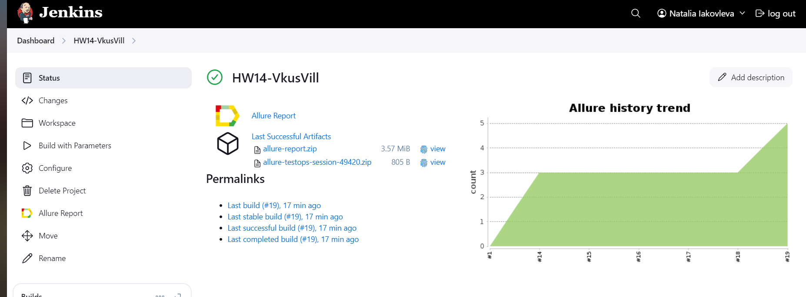
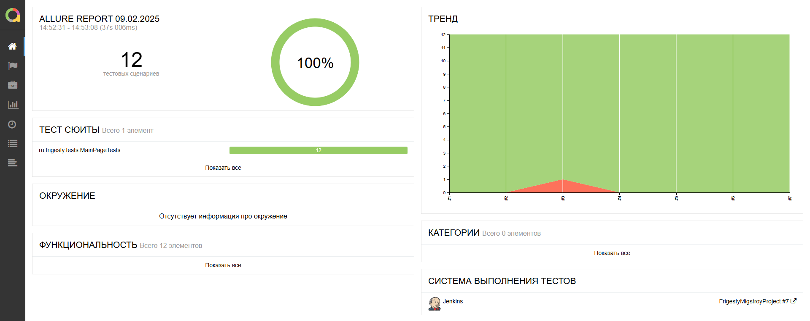
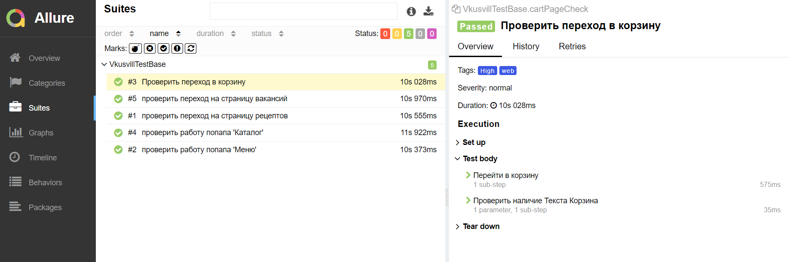
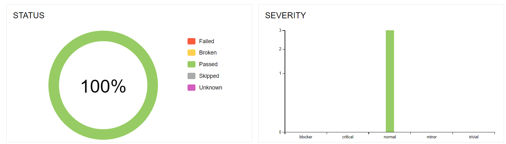
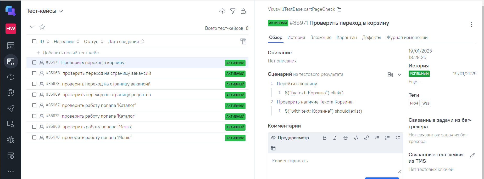
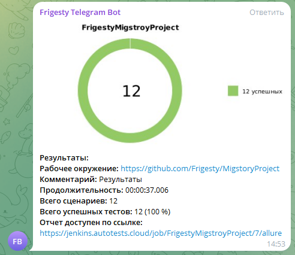


# Проект по автоматизации тестирования для компании [Миг строй](https://migstroy.spb.ru/)

> Компания **«Миг-Строй»** — надежный поставщик строительного оборудования.
> 
## **Содержание:**
____

* <a href="#tools">Технологии и инструменты</a>

* <a href="#cases">Примеры автоматизированных тест-кейсов</a>

* <a href="#jenkins">Сборка в Jenkins</a>

* <a href="#console">Запуск из терминала</a>

* <a href="#allure">Allure отчет</a>

* <a href="#allure-testops">Интеграция с Allure TestOps</a>

* <a href="#telegram">Уведомление в Telegram при помощи бота</a>

* <a href="#video">Примеры видео выполнения тестов на Selenoid</a>
____
<a id="tools"></a>
## <a name="Технологии и инструменты">**Технологии и инструменты:**</a>

<p align="center">  
<a href="https://www.jetbrains.com/idea/"></a>  
<a href="https://www.java.com/"></a>  
<a href="https://github.com/"></a>  
<a href="https://junit.org/junit5/"></a>  
<a href="https://gradle.org/"></a>  
<a href="https://selenide.org/"></a>  
<a href="https://aerokube.com/selenoid/"></a>  
<a href="https://allurereport.org/"></a> 
<a href="https://qameta.io/"></a>   
<a href="https://www.jenkins.io/"></a>  
</p>

____
<a id="cases"></a>
## <a name="Примеры автоматизированных тест-кейсов">**Примеры автоматизированных тест-кейсов:**</a>
____
- ✓ *Проверка работы поиска*
- ✓ *Проверка субменю каталога*
- ✓ *Проверка перехода на страницы из меню*
- ✓ *Проверка скаченного PDF-файла с сайта*
- ✓ *Проверка карусели слайдов*


____
<a id="jenkins"></a>
## </a><a name="Сборка"></a>Сборка в [Jenkins](https://jenkins.autotests.cloud/job/HW14-VkusVill/)</a>
____
<p align="center">  
<a href="https://jenkins.autotests.cloud/job/HW14-VkusVill/"></a>  
</p>


### **Параметры сборки в Jenkins:**

- *BROWSER (браузер, по умолчанию chrome)*
- *VERSION (версия браузера, по умолчанию 126)*
- *SIZE (размер окна браузера, по умолчанию 1920x1080)*
- *REMOTEURL (адрес хоста для удалённого запуска тестов)*


<a id="console"></a>
## Команды для запуска из терминала
___
***Локальный запуск:***
```bash  
gradle clean vkusvill_test
```
```bash  
gradle clean test
```

***Удалённый запуск через Jenkins:***
```bash  
clean 
vkusvill 
"-Dbrowser=${BROWSER}" 
"-DbrowserSize=${SIZE}" 
"-DbrowserVersion=${VERSION}" 
"-DremoteUrl=${REMOTEURL}"
```
___
<a id="allure"></a>
## </a> <a name="Allure"></a>Allure [отчет](https://jenkins.autotests.cloud/job/FrigestyMigstroyProject/7/allure/)</a>
___

### *Основная страница отчёта*

<p align="center">  
  
</p>  

### *Тест-кейсы*

<p align="center">  
  
</p>

### *Графики*

  <p align="center">  


</p>

___
<a id="allure-testops"></a>
## </a>Интеграция с <a target="_blank" href="https://allure.autotests.cloud/project/4578/dashboards">Allure TestOps</a>
____

### *Авто тест-кейсы*

<p align="center">  
  
</p>

____
<a id="telegram"></a>
## </a> Уведомление в Telegram при помощи бота
____
<p align="center">  
  
</p>

____
<a id="video"></a>
## </a> Примеры видео выполнения тестов на Selenoid
____
<p align="center">
   
</p>

